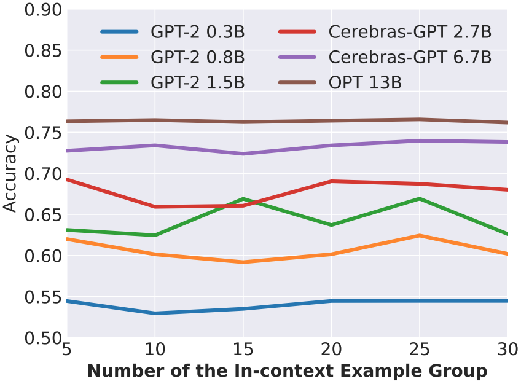

# D2Controller

Code and data for "[Dynamic Demonstrations Controller for In-Context Learning](https://arxiv.org/abs/2310.00385)".

##  Pilot Experiments
<div align="center">

</div>

- Increasing the number of demonstrations does not necessarily improve the model performance
- The optimal k-shot setting differs depending on specific datasets and models

##  Method

Based on the above analyses, we propose a method named D2Controller:

<div align="center">

</div>

-  D2Controller not only boosts ICL performance but also saves time and space during inference of the LLMs
-  We apply D2Controller to eight different sizes of LLMs and realize an average of 5.4% relative improvement across ten datasets. We also extend D2Controller to previous ICL models and yield competitive results


## Environment Setup
Create a new virtual environment with `Python==3.9.16`
```
conda create --name d2controller python=3.9.16
```

Install `requirement.txt`
```
pip install -r requirement.txt
```

## LLMs

Please download LLMs (except GPT-3) from the [HuggingFace](https://huggingface.co/). The LLMs we use in our paper include [`gpt2-medium`](https://huggingface.co/gpt2-medium), [`gpt2-large`](https://huggingface.co/gpt2-large), [`gpt2-xl`](https://huggingface.co/gpt2-xl), [`Cerebras-GPT-2.7B`](https://huggingface.co/cerebras/Cerebras-GPT-2.7B), [`Cerebras-GPT-6.7B`](https://huggingface.co/cerebras/Cerebras-GPT-6.7B), [`opt-13b`](https://huggingface.co/facebook/opt-13b) and [`opt-30b`](https://huggingface.co/facebook/opt-30b). Put the model files under `llm/` directory. For example
```

llm/
  |--gpt2-medium/
      |--config.json
      |--merges.txt
      |--pytorch_model.bin
      |--tokenizer.json
      |--vocab.json
  |--gpt2-large/
      |--...
      ...
  ...
```
## Running Code
### Preprocess 
run the bash script `do_preprocess.sh` to transform original dataset files
```
bash scripts/do_preprocess.sh
```


### Select k-shot setting
To obtain selected $k$-shot settings, run the script `run_selectk.sh`
```
bash scripts/run_selectk.sh
```

For OPT-30B model, we use the script `run_selectk_multi.sh` to obtain results
```
bash scripts/run_selectk_multi.sh
```
Notice that you should allocate names and directories for datasets and models in the script.


### Obtain ICL results
To obtain ICL results based on the select $k$-shot setting, run the script `run_icl.sh`
```
bash scripts/run_icl.sh
```

### Find Oracle k-shot setting
To obtain Oracle $k$-shot setting on validation set, run the script `run_oracle_k.sh`
```
bash scripts/run_oracle_k.sh
```

## GPT-3
We will release the code and scripts for GPT-3 later.

## Results

**Main Results**
<details>

| **Model** | **Setting** |**SST-2** | **SST-5** | **DBPedia** | **MR** | **CR** | **MPQA** | **Subj** | **AGNews** | **RTE** | **CB** | **AVG** |
|-----------|---------|:---------:|:---------:|:----------:|:---------:|:---------:|:---------:|:----------:|:---------:|:---------:|:----------:|:---------:|
| GPT-2 0.3B | Default | 58.1 &plusmn 13.1 | 24.1&plusmn7.4 | 60.6&plusmn7.2 | 54.2&plusmn10.6 | 50.6&plusmn0.4 | 59.6&plusmn15.8 | 53.4&plusmn5.3 | 48.7&plusmn8.5 | 51.3&plusmn1.7 | 48.6&plusmn6.4 | 50.9 |
| GPT-2 0.3B | D2Controller | 58.1&plusmn13.1 | 24.1&plusmn7.4 | 60.6&plusmn7.2 | 54.2&plusmn10.6 | 50.6&plusmn0.4 | 59.6&plusmn15.8 | 53.4&plusmn5.3 | 48.7&plusmn8.5 | 51.3&plusmn1.7 | 48.6&plusmn6.4 | 50.9 |
| GPT-2 0.3B | Oracle | 58.1&plusmn13.1 | 24.1&plusmn7.4 | 60.6&plusmn7.2 | 54.2&plusmn10.6 | 50.6&plusmn0.4 | 59.6&plusmn15.8 | 53.4&plusmn5.3 | 48.7&plusmn8.5 | 51.3&plusmn1.7 | 48.6&plusmn6.4 | 50.9 |

</details>

**D2Controller is beneficial to other ICL models**
<details>
  
| **Model** | **GPT-2 0.3B** | **GPT-2 0.8B** | **GPT-2 1.5B** | **Cerebras-GPT 2.7B** | **Cerebras-GPT 6.7B** |
|-----------|:---------:|:---------:|:---------:|:----------:|:---------:|
| KATE |  66.7 | 69.4 | 67.7 | 71.6 | 77.6 |
| KATE+D2Controller | 68.8 | 70.5 | 69.4 | 74.7 | 77.9 |
| GlobalE | 59.5 | 67.7 | 69.8 | - | - |
| GlobalE+D2Controller |  61.5 | 68.7 | 71.6 | - | - |
| Contextual Calibration | 59.5 | 64.2 | 63.9 | 67.2 | 72.5 |
| Contextual Calibration+D2Controller | 60.8 | 66.6 | 65.4 | 68.7 | 73.5 |
| kNN Prompting | 74.8 | 76.0 | 77.3 | 77.8 | 79.0 |
| kNN Prompting+D2Controller | 75.8 | 77.1 | 78.2 | 78.1 | 79.7 |

</details>

---

**D2Controller can achieve competitive results on a small number of in-context example groups**
<details>

<div align="center">

</div>

</details>

---

**IICScore is effective in selecting evaluation examples**
<details>

| **Model** | **GPT-2 0.3B** | **GPT-2 0.8B** | **GPT-2 1.5B** | **Cerebras-GPT 2.7B** | **Cerebras-GPT 6.7B** |
|-----------|:---------:|:---------:|:---------:|:----------:|:---------:|
| Random | 54.1 | 59.2 | 63.5 | 68.0 | 72.9 |
| D2Controller-ED | 54.4 | 59.2 | 64.0 | 67.1 | 72.6 |
| D2Controller-Cos | 54.9 | 59.3 | 62.2 | 68.3 | 72.4 |
| D2Controller |  54.5 | 62.4 | 66.9 | 69.3 | 74.0 |

</details>

---

**Dynamically selecting k performs better than using the maximum k**
<details>

| **Model** | **GPT-2 0.3B** | **GPT-2 0.8B** | **GPT-2 1.5B** | **Cerebras-GPT 2.7B** | **Cerebras-GPT 6.7B** |
|-----------|:---------:|:---------:|:---------:|:----------:|:---------:|
| kmax-shot setting | 54.1 | 58.7 | 66.0 | 65.4 | 73.0 |
| D2Controller | 54.5 | 62.4 | 66.9 | 69.3 | 74.0 |

</details>

---

## Citation
If you find this helpful, please cite our paper.

```bibtex
@misc{zhao2023dynamic,
      title={Dynamic Demonstrations Controller for In-Context Learning}, 
      author={Fei Zhao and Taotian Pang and Zhen Wu and Zheng Ma and Shujian Huang and Xinyu Dai},
      year={2023},
      eprint={2310.00385},
      archivePrefix={arXiv},
      primaryClass={cs.CL}
}
```
